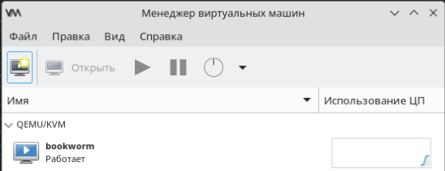

Шаблоны для сборки образов Российских ОС от Лаборатории 50
==========================================================

Набор шаблонов Packer для сборки образов Российских ОС.
Образы предназначены для использования c системой Vagrant.

| Образ                                 | Цели Makefile                         |
|---------------------------------------|---------------------------------------|
| Astra Linux 1.6                       | `smolensk-1.6.libvirt`                |
| Astra Linux 1.6 + Fly                 | `smolensk-1.6-fly.libvirt`            |
| Astra Linux 1.7                       | `smolensk-1.7.libvirt`                |
| Astra Linux 1.7 + Fly                 | `smolensk-1.7-fly.libvirt`            |
| Astra Linux 1.8                       | `smolensk-1.8.libvirt`                |
| Astra Linux 1.8 + Fly                 | `smolensk-1.8-fly.libvirt`            |
| Альт 10                               | `aronia.libvirt`, `aronia.vbox`       |
| Альт 10 + KDE                         | `aronia-kde.libvirt`                  |
| Альт 11                               | `salvia.libvirt`, `salvia.vbox`       |
| Альт 11 + KDE                         | `salvia-kde.libvirt`                  |
| Debian 12 (bookworm)                  | `bookworm.libvirt`, `bookworm.vbox`   |
| ГосJava 11                            | `gosjava11.libvirt`, `gosjava11.vbox` |
| МОНО                                  | `mono.libvirt`, `mono.vbox`           |
| РЕД ОС 7.3                            | `redos7.libvirt`, `redos7.vbox`       |
| РЕД ОС 8                              | `redos8.libvirt`, `redos8.vbox`       |
| РЕД ОС 8 + KDE                        | `redos8-kde.libvirt`                  |
| РОСА «ФРЕШ» 12.5                      | `fresh.libvirt`, `fresh.vbox`         |
| РОСА «ФРЕШ» 12.5 + KDE                | `fresh-kde.libvirt`                   |
| Ubuntu 22.04 LTS (Jammy Jellyfish)    | `jammy.libvirt`, `jammy.vbox`         |
| Ubuntu 24.04 LTS (Noble Numbat)       | `noble.libvirt`, `noble.vbox`         |
| Ubuntu 24.04 LTS (Noble Numbat) + KDE | `noble-kde.libvirt`                   |

# Настройка окружения для сборки образов

Тестировалось на Debian 12, Packer 1.11.2, QEMU 7.2.13, VirtualBox 7.0.20.

1. Установить QEMU и VirtualBox.
1. Установить Packer (может потребоваться VPN).
   Прямые ссылки:
   [packer_1.11.1_linux_amd64.zip](https://releases.hashicorp.com/packer/1.11.1/packer_1.11.1_linux_amd64.zip),
   [packer_1.11.2-1_amd64.deb](https://apt.releases.hashicorp.com/pool/amd64/main/packer_1.11.2-1_amd64.deb).
1. Установить плагины Packer:
   ```
   $ packer init config.pkr.hcl
   ```
1. Собрать бокс Debian 12 для libvirt:
   ```
   $ cd packer_templates/debian
   $ packer build -only qemu.bookworm bookworm.pkr.hcl
   ```
   или
   ```
   $ make bookworm.libvirt
   ```
1. Собрать бокс Debian 12 для VirtualBox:
   ```
   $ cd packer_templates/debian
   $ packer build -only virtualbox-iso.bookworm bookworm.pkr.hcl
   ```
   или
   ```
   $ make bookworm.vbox
   ```

Для тестирования собранного образа с libvirt предоставлен файл `Vagrantfile`,
который умеет автоматически регистрировать box-файл.

1. Установить libvirt:
   ```
   # apt-get -y install libvirt-daemon-system libvirt-clients libvirt-dev virt-manager qemu-system-x86-64
   ```
1. Добавить себя в группу `libvirt`:
   ```
   $ sudo usermod -aG libvirt $USER
   ```
   Чтобы изменения вступили в силу, надо перелогиниться.
1. Создать пул default в `/var/lib/libvirt/images`:
   ```
   $ virsh -c 'qemu:///system' pool-define-as default dir - - - - /var/lib/libvirt/images
   $ virsh -c 'qemu:///system' pool-start default
   $ virsh -c 'qemu:///system' pool-autostart default
   ```
1. Установить свежий Vagrant — https://www.vagrantup.com/downloads (может потребоваться VPN).
   Вот прямые ссылки на [vagrant_2.3.0_amd64.deb](https://apt.releases.hashicorp.com/pool/amd64/main/vagrant_2.3.0_amd64.deb) и [vagrant-2.3.0-1.x86_64.rpm](https://rpm.releases.hashicorp.com/fedora/36/x86_64/stable/vagrant-2.3.0-1.x86_64.rpm).
1. Уставить плагин Vagrant'а для работы с libvirt (может потребоваться VPN):
   ```
   $ vagrant plugin install vagrant-libvirt
   ```
   В качестве альтернативы можно грузить плагины с rubygems.org:
   ```
   $ vagrant plugin install --plugin-clean-sources --plugin-source https://rubygems.org vagrant-libvirt
   ```
1. Создать ВМ:
   ```
   $ vagrant up bookworm
   ```
1. Теперь можно открыть `virt-manager`, там уже должно быть соединение, настроенное на `qemu:///system`.
   
   

# Похожие проекты

- [https://github.com/boxcutter](https://github.com/boxcutter)
- [https://github.com/chef/bento](https://github.com/chef/bento)

# Лицензия

Распространяется под лицензией GNU General Public License v3.0.
Полный текст лицензии в файле `LICENSE`.

# Контакты

Репозиторий проекта: https://gitlab.com/lab50/rudev.io/boxes

Разработка поддерживается компанией [Лаборатория 50](https://lab50.net).
